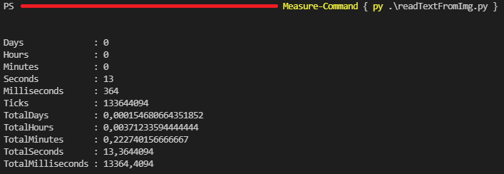

# Read text from image script

This script allows you to convert an image with text on it, to a .txt file.

It is useful when you want to select text on an image and you can't, or even when you want to use "ctrl + f" (**search function**) on an image. 

Feel free to change the variable in the files, for example to change the src directory.

For this script, you will need to install the pytesseract library.

&nbsp;&nbsp;&nbsp;Link is available here : [pytesseract](https://pypi.org/project/pytesseract/).

# Performances

By default, sources are on the "./src" directory and the output will be on the "./out" directory. There are 3 sample image with different extensions.

To test the speed performances, I used a powershell prompt and the command ```Measure-Command { py name_of_your_script }```.

For example : 



### Without threading

It takes approximately **13,64** seconds to process every sample file without processing every file in different threads. 

### With threading 

It takes approximately **7,854** seconds to process every sample file when each one is processed in a different thread.

### Conclusion

Adding threads to my program is very useful when processing several files at a time as it divided the processing time of the program by about 2 on the sample files.

Unfortunately, we can't faster the process of only one file, it is related to the pytesseract function's performances.